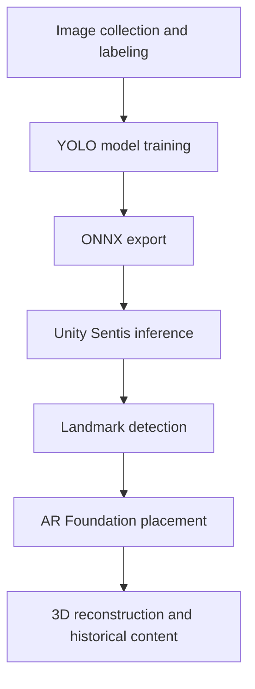

# HistoricalAR

**AI-powered mobile augmented reality for visualizing the reconstructed past of historical landmarks.**

HistoricalAR is a Software Engineering graduation project that combines computer vision, mobile augmented reality, and interactive 3D content. The current prototype recognizes the **Library of Celsus in Ephesus** and places a reconstructed 3D representation into the user's real environment on an iOS device.

The long-term goal is to help visitors experience damaged historical sites as they may have appeared in their original period, together with historically inspired characters and contextual information.

## Project Overview

HistoricalAR follows an end-to-end pipeline:

1. Collect and curate landmark images.
2. Label a custom object-detection dataset.
3. Train a YOLO-based landmark detector.
4. Export the trained model to ONNX.
5. Run on-device inference in Unity using Sentis.
6. Place and anchor a reconstructed 3D model with AR Foundation.
7. Display historical information and period-inspired characters.
8. Test the complete experience on a physical iPhone.

## Current Prototype

The prototype currently includes:

- Detection of the Library of Celsus from the live camera feed
- A custom-trained YOLO object-detection model
- ONNX model integration in Unity
- On-device inference with Unity Sentis
- iOS camera-frame processing
- AR raycasting and surface-aware placement
- Anchored, walk-through-scale 3D reconstruction
- Double-tap removal and repositioning
- Historical information panel
- Placement of Roman civilian character models
- Real-device builds and testing on an iPhone 11

## System Architecture

## Technology Stack

| Area | Technologies |
| --- | --- |
| Computer vision | Python, Ultralytics YOLO |
| Data preparation | Label Studio, Roboflow, FFmpeg, yt-dlp |
| Model deployment | ONNX, Unity Sentis |
| Mobile AR | Unity, C#, AR Foundation |
| iOS development | Xcode, ARKit |
| Development workflow | Git, GitHub, PyCharm |
| Testing | iPhone 11 |

## Key Engineering Work

### Computer Vision Pipeline

- Collected and cleaned landmark imagery from multiple sources
- Prepared and labeled a custom training dataset
- Trained and evaluated a YOLO-based detector for the Library of Celsus
- Exported the trained model to ONNX with a fixed 640 x 640 input
- Tuned confidence and IoU thresholds through image and device testing

### Unity and Mobile AR

- Implemented iOS camera-frame acquisition with `ARCameraManager`
- Integrated ONNX inference through Unity Sentis
- Implemented detection post-processing and coordinate conversion
- Built surface-aware AR placement using raycasts and anchors
- Added camera-aligned positioning, automatic scale calculation, and model centering
- Implemented touch-based removal and repositioning
- Added historical content and character placement
- Built and debugged the application with Unity and Xcode

## Main Unity Components

| Component | Responsibility |
| --- | --- |
| `CameraManager.cs` | Acquires and prepares AR camera frames |
| `ModelLoader.cs` | Loads the ONNX model with Unity Sentis |
| `ObjectDetector.cs` | Runs inference and processes detections |
| `ARPlacement.cs` | Places, scales, anchors, and repositions the reconstruction |
| `HistoricalCharacterPlacement.cs` | Positions period-inspired 3D characters |
| `HistoricalInfoPanel.cs` | Displays contextual information after placement |

## Current Development Status

The core iOS prototype is functional on a physical device. Current development work focuses on:

- Reducing false-positive detections through additional negative examples
- Improving portrait-orientation support
- Refining overlay alignment and placement stability
- Optimizing mobile inference performance
- Expanding beyond the Library of Celsus to additional structures in Ephesus

## Repository Scope

This repository is currently a **public project showcase**. Large datasets, trained model weights, licensed 3D assets, generated Unity folders, and iOS build outputs are intentionally excluded.

Selected source files, architecture documentation, screenshots, and a short demo will be added as the project is prepared for public release.

## Project Status

**In active development - academic graduation project**

A public demo and selected implementation files are coming soon.
